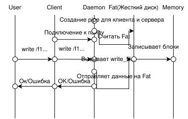

# Файловая система на основе FIFO с эмуляцией FAT

## 📋 Содержание
- [Описание проекта](#описание-проекта)
- [Модели данных](#модели-данных)
- [Физическое хранение](#физическое-хранение)
- [Команды](#команды)
- [Детали реализации](#детали-реализации)
- [Управление памятью](#управление-памятью)
- [Сборка и запуск](#сборка-и-запуск)
- [Тестирование](#тестирование)
- [Обработка ошибок](#обработка-ошибок)
- [Структура проекта](#структура-проекта)

## Описание проекта

Клиент-серверная файловая система с эмуляцией таблицы размещения файлов (FAT). Взаимодействие между клиентом и сервером осуществляется через именованные каналы (FIFO). Система поддерживает основные операции с файлами и директориями.



## Модели данных

### Block

```cpp
class Block {
public:
  long long start;  // начало блока в memory
  long long end;    // конец блока в memory
};
```

### FileType и FileInfo

```cpp
enum class FileType { FILE, DIR };

class FileInfo {
public:
  std::string name;           // полный путь
  std::vector<Block> data;    // блоки данных
  FileType type = FileType::FILE;
};
```

### FATData

```cpp
struct FATData {
  long long start_free_memory = 0;     // начало свободной памяти
  std::vector<Block> empty_blocks;     // список свободных блоков
  std::map<std::string, FileInfo> files; // все файлы и директории
};
```

## Физическое хранение

### Параметры

| Параметр | Значение |
|----------|----------|
| Размер блока | 2 байта |
| FAT файл | "FAT" |
| Memory файл | "./memory" |
| FIFO (команды) | "./myfifo" |
| FIFO (ответы) | "./server_fifo" |

### Формат FAT файла

```
<start_free_memory>,[<start>-<end>][<start>-<end>]...
<filepath>;<type>;[<start>-<end>][<start>-<end>]...
```

**Пример:**

```bash
0,[0-1][2-3]
/f1;f;[0-1]
/d1;d;
/d1/f2;f;[2-3]
```

## Команды

| Команда | Формат | Описание | Пример |
|---------|--------|----------|--------|
| **write** | `write <path> <content>` | Создание/запись файла | `write /file.txt "Hello"` |
| **read** | `read <path>` | Чтение файла | `read /file.txt` |
| **edit** | `edit <path> <content>` | Редактирование файла | `edit /file.txt "New"` |
| **mkdir** | `mkdir <path>` | Создание директории | `mkdir /docs` |
| **delete** | `delete <path>` | Удаление | `delete /docs` |
| **ls** | `ls <path>` | Список содержимого | `ls /docs` |
| **tree** | `tree <path>` | Древовидный вывод | `tree /` |
| **move** | `move <src> <dst>` | Перемещение файла | `move /f1 /d1/f2` |
| **exit** | `exit` | Выход из клиента | `exit` |

## Детали реализации

**write** — создаёт новый файл по указанному пути и записывает в него текст. Перед созданием проверяет, не существует ли уже файл с таким именем, и существуют ли все промежуточные директории. Текст разбивается на блоки фиксированного размера, которые сохраняются в memory-файле. Если есть свободные блоки, используются они, иначе выделяются новые в конце памяти.

**read** — читает содержимое файла и отправляет его клиенту. Проверяет, существует ли файл и является ли он именно файлом (а не директорией). Содержимое собирается из всех блоков, принадлежащих файлу.

**delete** — удаляет файл или директорию. Если удаляется директория, сначала рекурсивно находит все вложенные файлы и поддиректории. Затем удаляет всё в обратном порядке (от листьев к корню): освобождает блоки (добавляет их в список свободных), удаляет записи из родительских директорий и убирает объекты из FAT. Корневую директорию удалить нельзя.

**mkdir** — создаёт новую директорию. Проверяет, не существует ли уже объект с таким именем, и существуют ли все родительские директории. Директория создаётся как файл с типом DIR и пустым списком блоков. Также обновляется содержимое родительской директории.

**ls** — выводит список содержимого директории. Читает содержимое директории, парсит его по разделителю '/', определяет тип каждого объекта (файл или директория) и формирует список, где директории помечаются слешем в конце.

**tree** — рекурсивно обходит директорию и выводит её содержимое в виде дерева. Для каждого уровня вложенности добавляет отступы, помечает файлы буквой F, а директории — буквой D. Показывает полную структуру поддиректорий.

**move** — перемещает файл из одного места в другое. Проверяет существование исходного файла, существование целевой директории и что целевое имя не занято. Обновляет записи в старой и новой родительских директориях и меняет путь в информации о файле.

Клиент и сервер общаются через два именованных канала (FIFO):
1. ./myfifo - клиент пишет команды, сервер читает
2. ./server_fifo - сервер пишет ответы, клиент читает

При каждой команде клиент:
- Открывает ./myfifo на запись, отправляет команду
- Открывает ./server_fifo на чтение, ждёт ответ
- Закрывает оба канала

Сервер постоянно слушает ./myfifo и обрабатывает команды по очереди

## Управление памятью

### Выделение блоков

```cpp
if (data.empty_blocks.size() > 0) {
    // Стратегия "первый подходящий"
    long long start = data.empty_blocks[0].start;
    data.empty_blocks.erase(data.empty_blocks.begin());
} else {
    // Выделение нового блока
    long long start = data.start_free_memory;
    data.start_free_memory += BLK_SIZE;
}
```

### Освобождение блоков

```cpp
void delete_block(Block &block, FATData &data) {
    // Блоки не очищаются физически,
    // только помечаются как свободные
    data.empty_blocks.push_back(block);
}
```

### Пример состояния памяти

```
Начальное состояние:
Свободные блокы: [0-1][4-5]
Занятые блоки: [2-3] (файл /f1)

После удаления /f1:
Свободные блоки: [0-1][2-3][4-5]
Занятые блоки: (пусто)
```

## Сборка и запуск

### Требования

- C++17 или новее
- GCC/Clang
- Google Test (для тестов)
- CMake (опционально)

### Компиляция

```bash
# Сервер
g++ -std=c++17 -I. daemon/main.cpp -o server.out 

# Клиент  
g++ -std=c++17 client/client.cpp -o client.out

# Тесты
g++ -std=c++17 -I. tests/daemon/tests.cpp tests/daemon/constants.cpp -lgtest -lgtest_main -pthread -o test.out
```

### Запуск

```bash
# Терминал 1: сервер
./filesystem_server

# Терминал 2: клиент
./filesystem_client

# Пример сессии
> write /test.txt "Hello, World!"
Команда отправлена. Ожидание ответа...
Ответ сервера: OK

> read /test.txt
Команда отправлена. Ожидание ответа...
Ответ сервера: Hello, World!

> exit
```

## Тестирование

### Запуск тестов

```bash
./filesystem_test
```

### Набор тестов

| Тест | Проверяет |
|------|-----------|
| `CheckFATDataUpdated` | Создание файла и обновление FAT |
| `CheckUpdateMemory` | Запись данных в memory |
| `CheckFATDataUpdatedAndMemory` | Чтение файла |
| `EditFileTestMemory` | Редактирование файла |
| `ListRootDirectory` | Листинг корневой директории |
| `MakeDirectory` | Создание директории |
| `DeleteDir` | Удаление директории |
| `LsTest1-3` | Различные сценарии листинга |

## Обработка ошибок

### Коды ошибок

| Код | Значение | Описание |
|-----|----------|----------|
| `0` | `OK` | Успешное выполнение |
| `1` | `READ_DIR_ERR` | Попытка чтения директории |
| `2` | `READ_NO_EXISTING_FILE` | Файл не существует |
| `3` | `LS_NO_EXISTING_DIR` | Директория не существует |

### Сообщения об ошибках

```
Ошибка: файл '/test.txt' уже существует
Ошибка: '/docs' является директорией
Файл с именем '/nonexist' не существует
Ошибка: не существует какого-то из звеньев пути /a/b/c
Нельзя удалить /
```

## Структура проекта

```
.
├── client/
│   └── client.cpp              # Клиентская часть
├── daemon/
│   ├── main.cpp                 # Серверная часть
│   ├── fs_daemon.cpp            # Основная логика ФС
│   ├── fat_funcs.cpp             # Работа с FAT
│   ├── constants.cpp             # Константы
│   ├── constants.hpp
│   ├── model/
│   │   ├── block.hpp
│   │   ├── file_info.hpp
│   │   └── fat_data.hpp
│   └── utils/
│       ├── utils.hpp
│       ├── read.cpp              # Чтение файлов
│       ├── list_files.cpp        # Листинг
│       └── tree.cpp              # Дерево директорий
├── tests/
│   └── daemon/
│       ├── tests.cpp             # Модульные тесты
│       └── constants.cpp         # Константы для тестов
└── README.md
```
